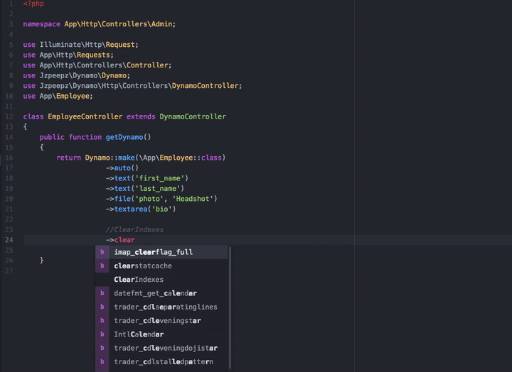
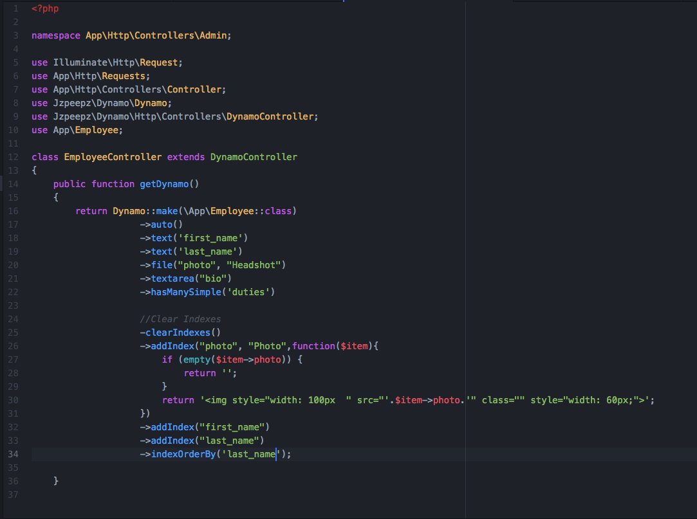

Customizing the admin
=====================

Admin customization happens in your controller inside the getDynamo() function of the Dynamo Controller.
This function returns a Dynamo instance which has lots of chainable methods that customize your Dynamo admin. Lets stick with our Employee example:

    .. image:: images/EmployeeController1.png
        :align: center

This is what your Dynamo Controller will look like by default right after it is created. It has one function called getDynamo() that returns a Dynamo object.
By default the auto() function is called which will take all the things your employee object consist of (that you defined in your database migration, say first_name, last_name,
phone_number) and create fields in the form for them. You can chain on methods to this auto function if you need to do more specific things.
It's super easy! Check it out...

Everything you see before the comment "//ClearIndexes" will appear in the form view when someone is creating an Employee object in the database.
Everything you see after the comment "//ClearIndexes" will appear in the index view when someone is viewing all the Employees in the database.
Now, keep in mind, all the function calls you see above happened automatically with the auto() function.
The only thing the auto function can't do is stuff like renaming a field like you see happen at "->file("photo", "Headshot")" where
you might want it to say Headshot rather than photo. We will go into this in more detail in the Dynamo Methods section.

This is the basics of Dynamo. You have created an admin on your custom CMS for managing Employees
on your Laravel application is less than 2 minutes. Isn't that powerful? You could do this for News Post, Products being sold on the site, Faq's and
Faq Categories, and so on.

.. note:: NOTE: For the full list of chainable methods on your Dynamo Object, refer to section Dynamo Methods!
