Dynamo Methods
==============
This section will list all available methods that you are able to chain onto your Dynamo object that you create inside your Dynamo Controller. For a very simple admin,
you might be able to get away with only using that auto() method which is auto-generated for you, and literally have no work to do. But in the case of a database relationship,
or the case of renaming a field in the form, or sizing a picture a specific way, etc, you need to use the methods below.

.. raw:: html

    

    

        

           <a href="#method-addActionButton">addActionButton</a>
           <a href="#method-addField">addField</a>
           <a href="#method-addFilter">addFilter</a>
           <a href="#method-addFormFooterButton">addFormFooterButton</a>
           <a href="#method-addFormHeaderButton">addFormHeaderButton</a>
           <a href="#method-addHandler">addHandler</a>
           <a href="#method-addIndex">addIndex</a>
           <a href="#method-addIndexButton">addIndexButton</a>
           <a href="#method-applyScopes">applyScopes</a>
           <a href="#method-auto">auto</a>
           <a href="#method-checkbox">checkbox</a>
           <a href="#method-clearIndexes">clearIndexes</a>
           <a href="#method-file">file</a>
           <a href="#method-group">group</a>
           <a href="#method-hasMany">hasMany</a>
           <a href="#method-hasManySimple">hasManySimple</a>
           <a href="#method-hideAdd">hideAdd</a>
           <a href="#method-hideDelete">hideDelete</a>
           <a href="#method-ignoredScopes">ignoredScopes</a>
           <a href="#method-indexOrderBy">indexOrderBy</a>
           <a href="#method-paginate">paginate</a>
           <a href="#method-password">password</a>
           <a href="#method-removeBoth">removeBoth</a>
           <a href="#method-removeField">removeField</a>
           <a href="#method-removeIndex">removeIndex</a>
           <a href="#method-searchable">searchable</a>
           <a href="#method-select">select</a>
           <a href="#method-setAddItemText">setAddItemText</a>
           <a href="#method-setFormPanelTitle">setFormPanelTitle</a>
           <a href="#method-setIndexPanelTitle">setIndexPanelTitle</a>
           <a href="#method-setPreviewLink">setPreviewLink</a>
           <a href="#method-setSaveItemText">setSaveItemText</a>
           <a href="#method-text">text</a>
           <a href="#method-textarea">textarea</a>
        

    

.. note:: This list is alphabetical order, and you can quickly jump to a function description by clicking the links above

.. raw:: html

    

    

    <h4><code>Options that can be passed into any dynamo field</code></h4>
    
Before going over the methods, it's important to understand that there is "field partials" for each type of field in Dynamo. There is text, select, hasMany,
       group, file, checkbox, password, and textarea partials of code that get used when you call a function on the DynamoController. These partials of code look to see if
       you passed in any extra options to be applied. For example, you can pass in a "tooltip" option to any field to render a tooltip next to the input's label.  
       Here I use the select function which renders the select.blade.php partial of code in the dynamo package. I pass in some additional options that I want applied to that partial
       code. The first is "attributes". For this option, set its value to an array of HTML attributes that you want applied to your input field, like disabled is true. This makes
       it where the input field can't be edited by the user. The next option is "options", which is how you pass in the different possible things that can be selected. In this case,
       I use an Eloquent model called "Testing" and call that functions getStatusus() function which returns an array of key-value pairs. this array says 10 = Draft and 30 = Published.
       So if they select to save the post as a Draft, it will save the number 10 in the status field in the database. Next we have label which just changes the text of the input's label.
       By default this label will be the name of the database field passed in; in this case, that is status. Next we have tooltip, then we have position. By default Dynamo will position
       the order of the input fields on the form in the order you write them, but when using the auto function sometimes things get out of position, so you can manually set the order.
       

.. code-block:: trafficscript

    ->select('status', [
         'attributes' => ['disabled' => true, 'colton' => ''],
         'options' => Testing::getStatuses(),
         'label' => 'Your Address Please sir',
         'tooltip' => 'Use the \'\'Draft\'\' status to save information as you have it. When you\'re ready for an FAQ to
                       show up on the front end of the website, change it to \'\'Published\'\' and then click the \'\'Save FAQ\'\' button.',
         'position' => 200,
         'required' => true,
     ])

.. raw:: html

    

    

    <h4><code>addActionButton()</code></h4>
    
The <code>addActionButton</code> method allows you to create a button along-side the other default action buttons, Edit and Delete. Keep in mind these default buttons can be
       remove by calling hideDelete()

.. code-block:: trafficscript

    ->addActionButton(function() {
         return '<a href="/pilot/testing" class="btn btn-primary btn-sm">Test</a>';
     })

Here we see the code, simply chain the function onto your Dynamo object in your Dynamo controller. addActionButton() takes one parameter which should be a closure function
that returns raw html for a link and bootstraps button classes. You can return any raw html you want; it doesn't have to be bootstrap, you could just use the button html tag.

Result:

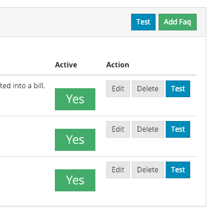

.. raw:: html

    

    

    <h4><code>addField()</code></h4>
    
The <code>addField</code> method is a bit tricky. You will never actually call this method directly. However, the Dynamo has a PHP magic method __call
       that calls addField. In the case where you use methods such as text(), file(), checkbox(), hasMany(), password(), select(), textarea(), you are actually
       just calling __call() in reality, which calls addField(). Now, you are free to create your own methods similar to the ones I just listed. You have to created
       them in the vendor->jzpeepz->dynamo->src->resources->views->partials->fields directory.

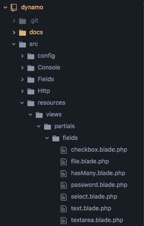

Path to addField() partials.

.. raw:: html

    

    

    <h4><code>addFilter()</code></h4>
    
The <code>addFilter</code> method is a brand new function in Dynamo that lets you filter the index view of an admin by whatever you want. We needed to implement
       this feature for our House of Representatives project because our client wanted to be able to "Filter" the Representatives by Terms. Terms and Representatives have
       a many-to-many relationship with each other in our database. See how we used addFilter below.

.. code-block:: trafficscript

    ->addFilter('term', Term::orderBy('name', 'desc')->get()->prepend(['id' => '', 'name' => 'All'])->pluck('name', 'id'), function ($query) {
         $termId = request()->input('term');

         if (empty($termId)) {
             return $query;
         }

         return $query->select('representatives.*')
                      ->distinct()
                      ->join('representative_term', 'representative_term.representative_id', '=', 'id')
                      ->where('representative_term.term_id', $termId);
     });

Here is where we called addFilter on the DynamoController. The parameters are the database field you want to filter by(in this case terms), a collection
of the objects(in this case, we grabbed all terms names and sorted them in descending order), then a closure function that actually does the filtering. In
this case, depending on what term you choose, we will grab all the Representatives from that term.

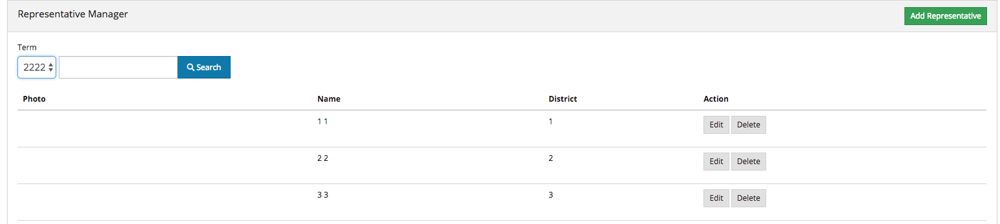

Filtered by Term 2222

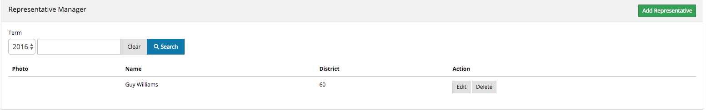

Filtered by term 2016

.. raw:: html

    

    

    <h4><code>addFormFooterButton()</code></h4>
    
The <code>addFormFooterButton</code> method let's you add a custom button on the footer section of the dynamo form. You can call this function as many times as you want
       and buttons will keep rendering next to the delete button. One unique thing you can do in the bootstrap 4 version of Dynamo is call ->hideDelete() followed by calling
       ->addFormFooterButton() to "override" the delete button with a data-toggle="modal" data-target="#relationships-manager-modal" included in the markup. Check out the screenshots below

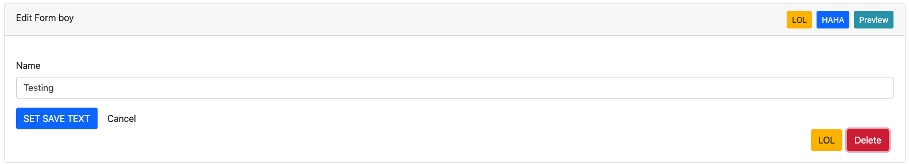

Here I've called many different functions on this dynamo form, but we only interested in the bottom right-hand corner. I've called ->hideDelete() and ->addFormFooterButton()
to "overwrite" the delete button with my own delete button that does something extra you'll see in the next screenshot. I also called ->addFormFooterButton() a second time
to get that "LOL" button that you, and it links to whatever page I want it to within my website/application.

.. code-block:: trafficscript

    ->addFormFooterButton(function() {
        return '<a href="/pilot/testing" class="btn btn-warning btn">LOL</a>';
    })
    ->addFormFooterButton(function() {
        return '<a href="" class="btn btn-danger btn" data-toggle="modal" data-target="#relationships-manager-modal">Delete</a>';
    })
    ->hideDelete()

Here you see how I override the delete button. I use my ->addFormFooterButton function to create a Bootstrap 4 button that has data-toggle="modal" data-target="#relationships-manager-modal"
included. This makes this delete button open up a Bootstrap 4 modal when clicked. This modal is built into Dynamo so all you have to do is overwrite the delete button. The modal that pops
up allows the user to delete the category they are currently editing. See the next screenshot for what the modal looks like.

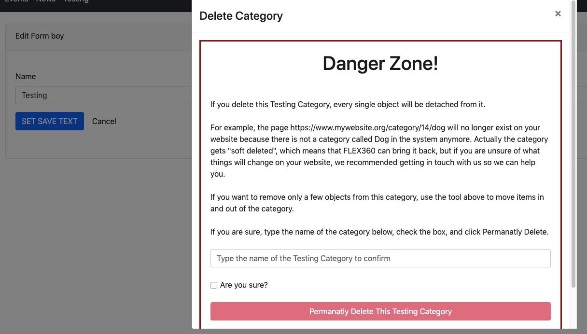

Here you see the Bootstrap modal that pops up after clicking the delete button. If the user types the name of the category and checks the box they can delete the category.
Form Footer Buttons are awesome!

.. raw:: html

   

   

   <h4><code>addFormHeaderButton()</code></h4>
   
The <code>addFormHeaderButton</code> method let's you add a custom button on the header section of the dynamo form. Foreach time you call this function,
      a new button will appear on the header in the order you called the functions. By default, Dynamo creates a "View" button that is rendered if you are editing
      an item. The view button's link will call the url() function that you created on your Dynamo model. So if you created a Dynamo object called "FAQ", you would
      want to implement a function on that model called url(). Check out the screenshots below

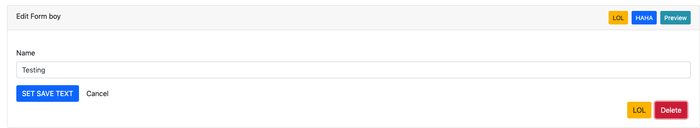

Here you can see I called ->addFormHeaderButton() twice to create a bootstrap4 primary button with the text "HAHA" and a bootstrap4 warning button with the text "LOL".
Of course, you can make these buttons link to anywhere in your website/application. See the code below

.. code-block:: trafficscript

    ->addFormHeaderButton(function() {
        return '<a href="/pilot/testing" class="btn btn-primary btn-sm">HAHA</a>';
    })
    ->addFormHeaderButton(function() {
        return '<a href="/pilot/testing" class="btn btn-warning btn-sm">LOL</a>';
    })

.. raw:: html

    

    

    <h4><code>addHandler()</code></h4>
    
The <code>addHandler</code> method is .... (TBD)

.. code-block:: trafficscript

    ->select('status', [
         'attributes' => ['disabled' => true, 'colton' => ''],
         'options' => Testing::getStatuses(),
         'label' => 'Your Address Please sir',
         'tooltip' => 'Use the \'\'Draft\'\' status to save information as you have it. When you\'re ready for an FAQ to
                       show up on the front end of the website, change it to \'\'Published\'\' and then click the \'\'Save FAQ\'\' button.',
         'position' => 200,
     ])

(TBD)

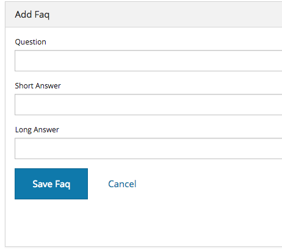

.. raw:: html

    

    

    <h4><code>addIndex()</code></h4>
    
The <code>addIndex</code> method allows you to add a new column to the index view of your module. This method takes up to
       three parameters, but only passing one is necessary. The first parameter is the name of the field in your database. The second
       is the how you want the name to appear in the index view. The third is a closure function to do something specific. Notice
       in the examples below of cases where addIndex is used with one, two, and three parameters and their outputs on the index view.

.. code-block:: trafficscript

        ->clearIndexes()
        ->addIndexButton(function () {
            return '<a href="/pilot/representative/import" class="btn btn-primary btn-xs">Import Representatives from Spreadsheet</a>';
        })
        ->addIndex('headshot', 'Photo', function ($item) {
            if (empty($item->headshot_small)) {
                return '';
            }
            return 'headshot_small. '" class="" style="width: 60px;">';
        })
        ->addIndex('name')
        ->addIndex('district')
        ->searchable('first_name')
        ->searchable('last_name')
        ->indexOrderBy('last_name')

In the closure function, we are checking to see if this Representative has a Headshot photo in the database or not. If not, just display an empty string.
If so, display their image with a certain width.

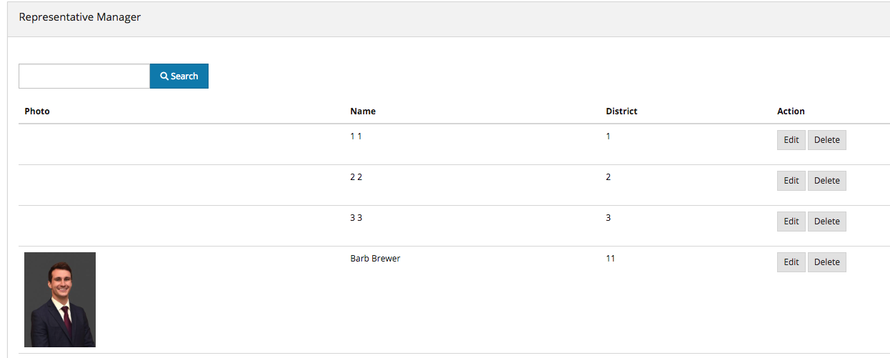

The first three Representatives did not have pictures, the fourth did.

.. code-block:: trafficscript

    ->clearIndexes()
    ->addIndex('title')
    ->addIndex('short_description')
    ->addIndex('activate', 'Active', function ($item) {
        //return $item->activate ? '<h3>Yes</h3>' : '<h3>No</h3>';
        return $item->activate ? '<i class="far fa-check-circle fa-3x" style="color: green; padding-top: 10px;"></i>' :
        '<i class="far fa-times-circle fa-3x" style="color: red; padding-top: 10px;"></i>';
    })

The third addIndex uses a closure that uses a ternary operation to check if this Alert is activated. If so, a success box is rendered with the word "Yes" in it.
If not, a danger box is rendered with the word "No" in it.

.. image:: images/addIndex4.png
    :align: center

.. raw:: html

    

    

    <h4><code>addIndexButton()</code></h4>
    
The <code>addIndexButton</code> method allows you to add a button along side the Add button in your Dynamo Manager. One example of where you would want to use addIndexButton
       would be if you wanted to minimize the amount of modules in your navigation. Below is an example:

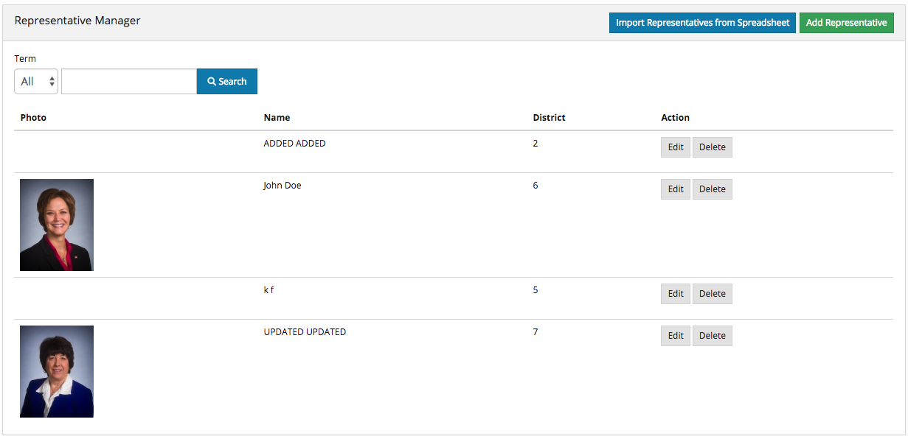

Here, in the top right corner, we add a button in the Representatives Manager that says Import Representatives from Spreadsheet that links to
another form for uploading Representatives via .csv.

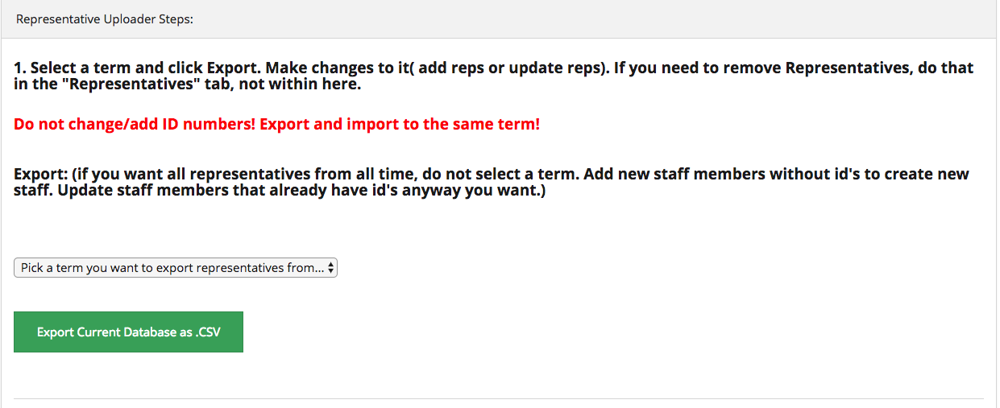

This is the page the button links to

.. code-block:: trafficscript

    ->addIndexButton(function () {
        return '<a href="/pilot/representative/import" class="btn btn-primary btn-xs">Import Representatives from Spreadsheet</a>';
    })

This is the function in use. It takes one parameter that is a closure function that returns raw html linking to that page.

.. raw:: html

    

    

    <h4><code>applyScopes()</code></h4>
    
The <code>applyScopes</code> method allows you to apply all global scopes that are defined in your app. This function gets called by default if you run the auto() function.
       We created this function because sometimes you don't run the auto function but still want to apply your scopes. This is especially helpful if you are using soft deletes.
       This function works together with ->ignoredScopes([]) which takes in an array of scopes that you want to ignore.

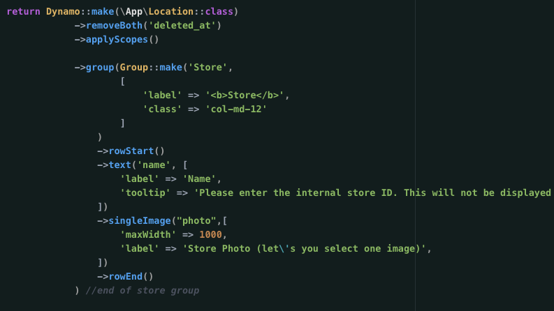

.. raw:: html

    

    

    <h4><code>auto()</code></h4>
    
The <code>auto</code> method is called by default in your DynamoController and will auto-populate the form
       with text boxes for each field in the database for that object, and will automatically set the index view with those same fields.

.. code-block:: trafficscript

    class FaqController extends DynamoController
    {
        public function getDynamo()
        {

        return Dynamo::make(\App\Faq::class)
                 ->auto()

        }
    }

Auto function being called on the newly created Dynamo object.

The form that auto() produces for the Faq object.

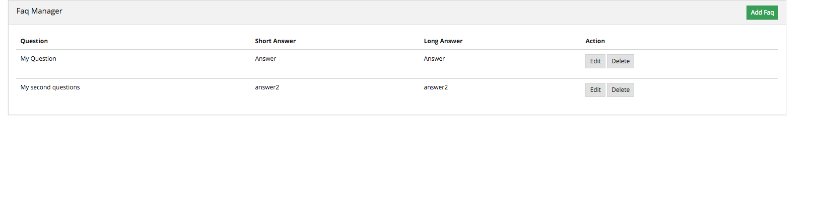

The index view auto() produces for Faqs.

.. raw:: html

    

    

    <h4><code>checkbox()</code></h4>
    
The <code>checkbox</code> method lets you add a checkbox to your form. It is particularly useful if you have a boolean attribute for an object in your database.
       For example, we used checkboxes on our House of Representatives website to allow the user to "Activate" Faq's and Alerts, as seen in the screenshots below.

.. code-block:: trafficscript

         ->auto()
         ->checkbox('activate', [
           'label' => 'Activate: Only one may be active at a time'
         ])

         //set admin view
         ->clearIndexes()
         ->addIndex('title')
         ->addIndex('short_description')
         ->addIndex('activate', 'Active', function ($item) {
             //return $item->activate ? '<h3>Yes</h3>' : '<h3>No</h3>';
             return $item->activate ? '<i class="far fa-check-circle fa-3x" style="color: green; padding-top: 10px;"></i>' :
             '<i class="far fa-times-circle fa-3x" style="color: red; padding-top: 10px;"></i>';
         })
         ->indexOrderBy('title');

A checkbox method is called here, with an array of options containing one option, 'label', so let the user know that they can only activate one Alert at a time.

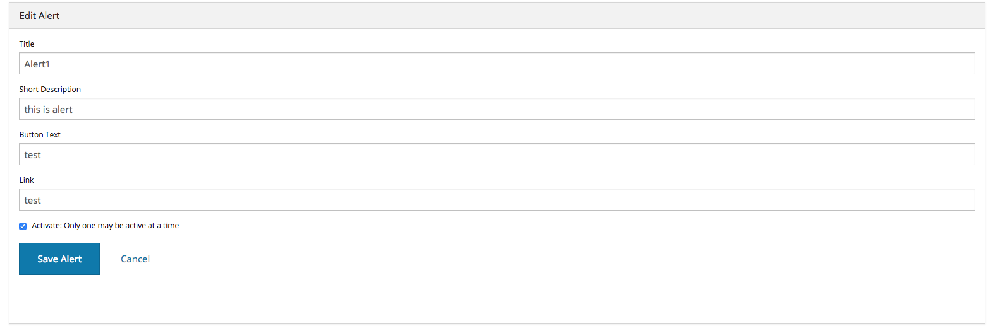

The result on the form for Alerts.

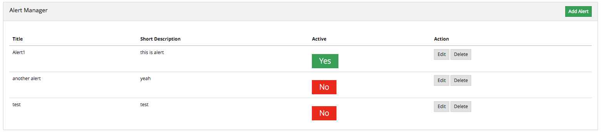

The result on the index view for Alerts.

.. raw:: html

    

    

    <h4><code>clearIndexes()</code></h4>
    
The <code>clearIndexes</code> method will remove all the columns that are generated from the auto() function that is at
       the top of the DynamoController by default. After calling clearIndexes, you will certainly want to call addIndex right after.
       Notice the examples below.

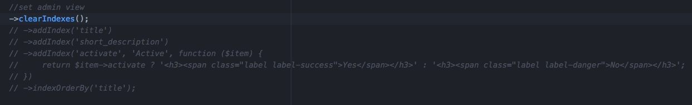

I've commented out my addIndex() calls for the sake of demonstration. The next image shows the result.

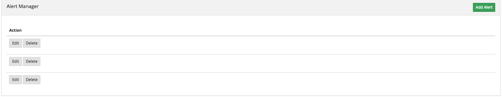

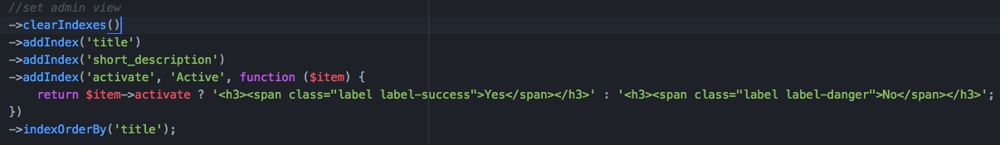

Now I've uncommented my addIndex calls to show the result in the next image.

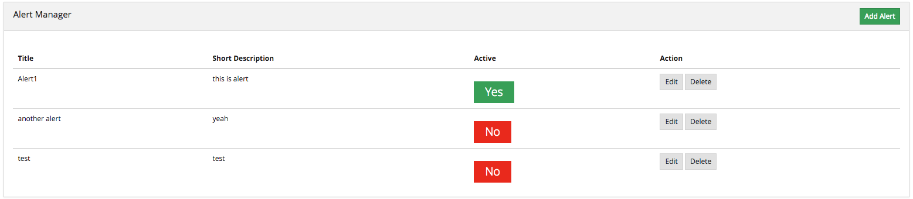

.. raw:: html

    

    

    <h4><code>file()</code></h4>
    
The <code>file</code> method will allow the user to select a file from their computer when filling out the form for this field. Let's say you have a Staff module
       and you want the user to be able create Staff "objects" with their name, and photo. Check out the example below.

.. code-block:: trafficscript

         ->auto()
         ->file('photo')
         ->textarea('bio', [
             'class' => 'wysiwyg-editor',
         ])
         ->text('job_title_extra', [
             'label' => 'Additional Job Title (optional)',
         ])
         ->hasManySimple('departments')
         ->removeField('position')

         //Set indexes for admin view
         ->clearIndexes()
         ->addIndex('photo', 'Photo', function ($item) {
             if (empty($item->photo)) {
                 return '';
             }
             return 'photo. '" class="" style="width: 60px;">';
         })
         ->addIndex('first_name')
         ->addIndex('last_name')
         ->addIndex('departments', "Departments", function($item){

             return $item->departments->implode('name', ', ');

         })

         ->indexOrderBy('last_name');

Notice the file method call.

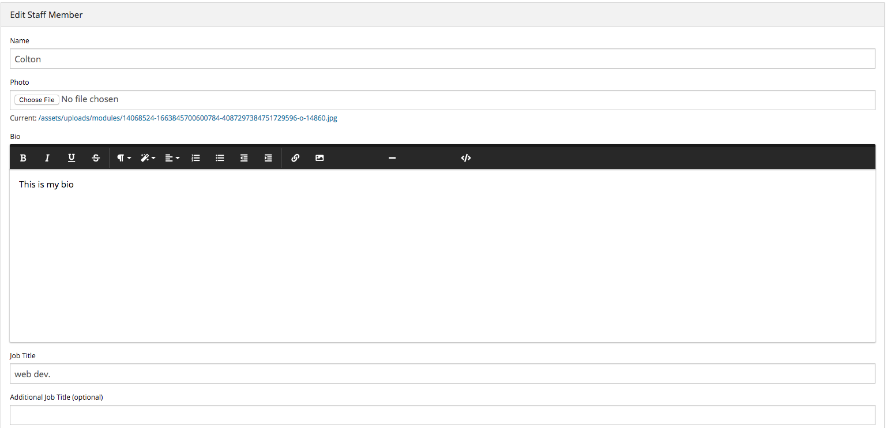

This is the result for the form view. The user can select the photo from their computer.

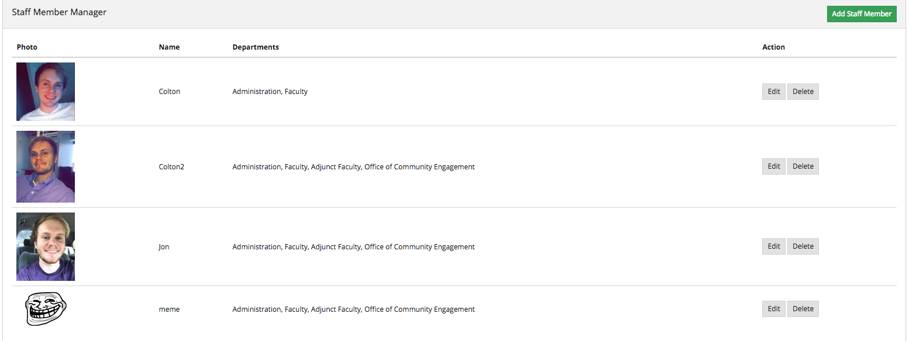

This is the result of the index view.

.. raw:: html

    

    

    <h4><code>group()</code></h4>
    
The <code>group</code> method is... ( TBD )

.. code-block:: trafficscript

    ->select('status', [
         'attributes' => ['disabled' => true, 'colton' => ''],
         'options' => Testing::getStatuses(),
         'label' => 'Your Address Please sir',
         'tooltip' => 'Use the \'\'Draft\'\' status to save information as you have it. When you\'re ready for an FAQ to
                       show up on the front end of the website, change it to \'\'Published\'\' and then click the \'\'Save FAQ\'\' button.',
         'position' => 200,
     ])

(TBD)

.. raw:: html

    

    

    <h4><code>hasMany()</code></h4>
    
The <code>hasMany</code> method is called by default in your DynamoController and will auto-populate the form
       with text boxes for each field in the database for that object, and will automatically set the index view with those same fields.

.. code-block:: trafficscript

   ->select('status', [
        'attributes' => ['disabled' => true, 'colton' => ''],
        'options' => Testing::getStatuses(),
        'label' => 'Your Address Please sir',
        'tooltip' => 'Use the \'\'Draft\'\' status to save information as you have it. When you\'re ready for an FAQ to
                      show up on the front end of the website, change it to \'\'Published\'\' and then click the \'\'Save FAQ\'\' button.',
        'position' => 200,
    ])

(TBD)

.. raw:: html

    

    

    <h4><code>hasManySimple()</code></h4>
    
The <code>hasManySimple</code> method is used when you want the user to be able to "multi-select" another object that is related to this object. For example, a
       common database relationship on websites might be: "FAQs have many FAQ Categories, and FAQ Categories have many FAQs". If you have made this relationship in your
       database using foreign keys and such, then you can use this method. First go to the model of FAQ and add a public function that says FAQs belongToMany FAQ Categories,
       and go to the model of the FAQ Category and do the same. Next, you will be able to chain on the hasManySimple() function on the FAQ DynamoController! Check out the
       example below.

.. code-block:: trafficscript

      Schema::create('faqs', function (Blueprint $table) {
          $table->increments('id');
          $table->string('question');
          $table->string('short_answer');
          $table->string('long_answer');
          $table->string('faq_categories');
          $table->timestamps();
      });

      Schema::create('faq_categories', function (Blueprint $table) {
          $table->increments('id');
          $table->string('name');
          $table->timestamps();
      });

      Schema::create('faq_faq_category', function (Blueprint $table) {
          $table->integer('faq_id')->unsigned();
          $table->foreign('faq_id')->references('id')->on('faqs');

          $table->integer('faq_category_id')->unsigned();
          $table->foreign('faq_category_id')->references('id')->on('faq_categories');
      });

First ^^ , make sure you have created the relationship your in database migrations.

.. code-block:: trafficscript

    *This function goes on the Faq model*
    public function faq_categories()
    {
        return $this->belongsToMany('App\FaqCategory');
    }

    *This function goes on the FaqCategory model*
    public function faqs()
    {
        return $this->belongsToMany('App\Faq');
    }

Next ^^ , make sure both your models have a public function that relates the two.

.. code-block:: trafficscript

    ->auto()
    ->text('question')
    ->text('short_answer')
    ->textarea('answer', [
        'class' => 'wysiwyg-editor',
    ])
    ->hasManySimple('faq_categories')

    // setup the index view
    ->clearIndexes()

    ->addIndex('question')

    ->addIndex('short_answer');

Now ^^ , on the controller, you can call hasManySimple() and the first parameter should be named EXACTLY the way you named the functions on the model in the previous
steps. ( which is faq_categories )

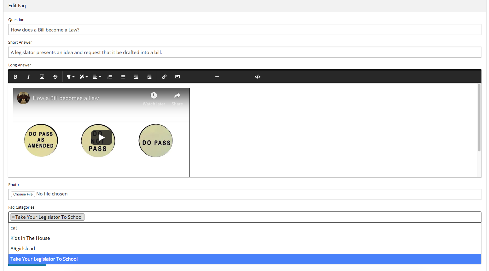

This is the result on the form. The user is able to select many categories for each FAQ they make.

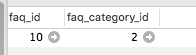

And when they submit the form, your database will create the relationship between this FAQ_id and that FAQ Category_id.

.. raw:: html

    

    

    <h4><code>hideAdd()</code></h4>
    
The <code>hideAdd</code> method simply hides the Add button, so the user isn't able to add new objects/items into the database. You would use this
       if you wanted them to be able to view, edit, and delete the items, but not add new items. You could also use the hideDelete() method in combination with this method.

.. code-block:: trafficscript

   ->auto();
   //hideAdd()

First I comment out hideAdd() to show the default.

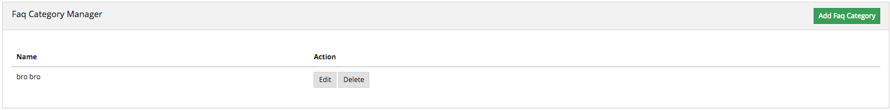

Notice that the add FAQ Category button exist in the top right corner of the container by default.

.. code-block:: trafficscript

   ->auto()
   hideAdd();

Now I uncomment hideAdd(), ...

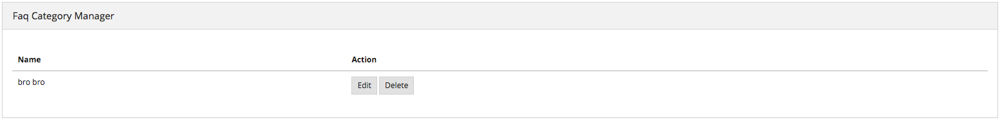

Now the FAQ Category button isn't available to the user so they can't create new FAQ Categories.

.. raw:: html

    

    

    <h4><code>hideDelete()</code></h4>
    
The <code>hideDelete</code> method simply hides the delete button on the index view, so the user will not be able to delete the
       object/item from the database.

.. code-block:: trafficscript

  ->auto();
  //hideDelete()

First I just took a basic DynamoController and commented out the hideDelete() function to show the default.

.. image:: images/hideDelete2.png
    :align: center

Notice you have an Edit/Delete button by default under your Action index

.. code-block:: trafficscript

  ->auto()
  hideDelete();

Now I uncomment hideDelete(), ...

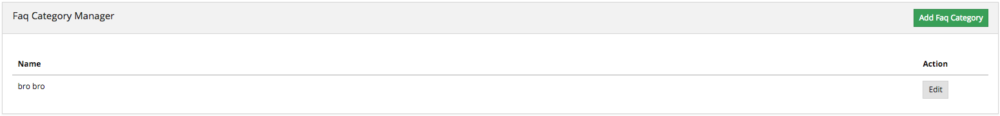

And the delete button is hidden. Magical isn't it?

.. raw:: html

    

    

    <h4><code>ignoredScopes([])</code></h4>
    
The <code>ignoredScopes([])</code> method takes in an array of scopes that you want to set to be ignored when you run ->applyScopes(). applyScopes() gets run default
       if you use the auto() function.

.. code-block:: trafficscript

   ->ignoredScopes(['deleted_at', 'age_scope'])
   ->applyScopes()
   ->removeField('position')

   //set admin view
   ->clearIndexes()
   ->addIndexButton(function () {
       return '<a href="/pilot/staff/import" class="btn btn-primary btn-xs">Import Staff from Spreadsheet</a>';
   })
   ->addIndex('hamburger', 'Sort', function($item) {
       return '<i class="fas fa-bars fa-2x" ></i>';
   })
   ->addIndex('name')
   ->addIndex('job_title')
   ->indexOrderBy('position');

.. raw:: html

    

    

    <h4><code>indexOrderBy()</code></h4>
    
The <code>indexOrderBy</code> method is how you order all the objects in the index view. Commonly, you might order by last name or by date created.
       By default, it orders in ascending order, you can pass a second parameter of 'desc' if you'd like to reverse it.

.. code-block:: trafficscript

   ->auto()
   ->removeField('position')

   //set admin view
   ->clearIndexes()
   ->addIndexButton(function () {
       return '<a href="/pilot/staff/import" class="btn btn-primary btn-xs">Import Staff from Spreadsheet</a>';
   })
   ->addIndex('hamburger', 'Sort', function($item) {
       return '<i class="fas fa-bars fa-2x" ></i>';
   })
   ->addIndex('name')
   ->addIndex('job_title')
   ->indexOrderBy('position');

In this case, rather than indexOrderBy('last_name'), we made it where the user could drag-and-drop the staff members in the order they would like in the index view.
Wherever they dropped the Staff member, it would update that staff members position in the database. Then we can just indexOrderBy('position').

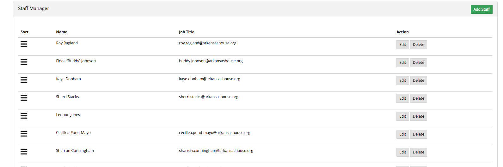

.. raw:: html

    

    

    <h4><code>paginate()</code></h4>
    
The <code>paginate</code> method does exactly what you think it would. It paginates the items in the index view so whatever number of items you want per page
       and provides page links at the bottom of the table.

.. code-block:: trafficscript

    ->paginate(10)

I call paginate and pass in 10 so I get 10 items per page. See the screenshot below. We have 10 FAQs on the first page and links to the next pages below the table

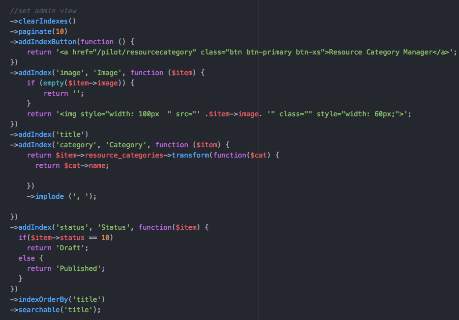

.. raw:: html

    

    

    <h4><code>password()</code></h4>
    
The <code>password</code> method... ( TBD )

.. code-block:: trafficscript

     ->password()

TBD ...

.. raw:: html

    

    

    <h4><code>removeBoth()</code></h4>
    
The <code>removeBoth</code> method removes the field from the index AND the form. It is basically removeField() and removeIndex() both in one function.
       please read those two functions directly below this one.

.. raw:: html

    

    

    <h4><code>removeField()</code></h4>
    
The <code>removeField</code> method removes any field that you pass it from the form view. This method is needed when the auto() function
       adds a field on the form you don't want the user to fill out. A common case of using removeField would be like in the indexOrderBy example, where we order staff members
       by position. But we don't actually want the user to be able to set the position manually within the form. So we removeField('position'). They update the
       position by drag-and-drag in that case. Check it out below

.. code-block:: trafficscript

    ->auto()
    ->removeField('position')

    //set admin view
    ->clearIndexes()
    ->addIndexButton(function () {
       return '<a href="/pilot/staff/import" class="btn btn-primary btn-xs">Import Staff from Spreadsheet</a>';
    })
    ->addIndex('hamburger', 'Sort', function($item) {
       return '<i class="fas fa-bars fa-2x" ></i>';
    })
    ->addIndex('name')
    ->addIndex('job_title')
    ->indexOrderBy('position');

See how we remove the position field in the form. We don't want the user to have to fill that out in the form because they are able to drag-and-drop staff members
to set the position in the index view.

.. raw:: html

    

    

    <h4><code>removeIndex()</code></h4>
    
The <code>removeIndex</code> method is exactly the same as removeField right above this. The only difference is you are removing an a column from the index
       view that was automatically added by the auto() function. Usually, we don't see this function since we use clearIndexes() and addIndex() to start from scratch anyways.
       But in the case that auto() is doing everything you need it to do minus one pesky index you don't want to see in the index view, removeIndex is less code to type than
       starting from scratch.

.. raw:: html

    

    

    <h4><code>searchable()</code></h4>
    
The <code>searchable</code> method allows you to define with parts of the model are searchable. The parameter you
       pass into this function must be the name of the field in the database that you want to be searchable in the search
       bar. For example, if you have an admin called Representatives, and you want to have a search bar where the user can search
       for staff members by their first and last name you might chain on the searchable method twice:
       

.. code-block:: trafficscript

    ->searchable('first_name')
    ->searchable('last_name')

Here we call searchable twice for first and last name.

Here we see you can search by last_name

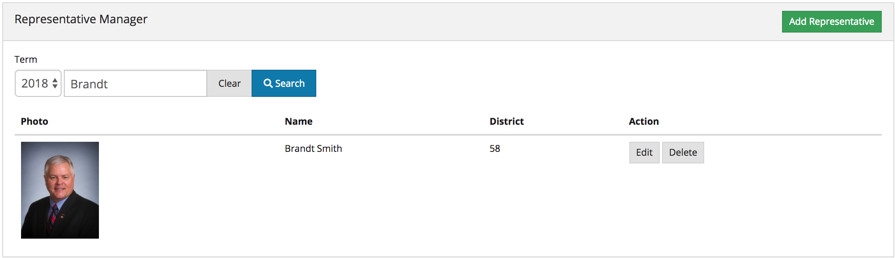

Here we see you can search by first_name

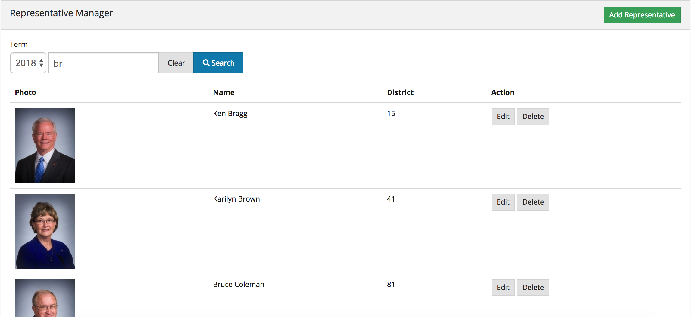

Here we see search working for first and last name at the same time.

.. raw:: html

    

    

    <h4><code>select()</code></h4>
    
The <code>select</code> method will allow the user to use a select box and select a single item. When you use the select method, your second parameter
       will be an array all the options they have to select from.

.. code-block:: trafficscript

    ->select('faq_category_id', [
       'options' => FaqCategory::all()->prepend(['name' => '', 'id' => ''])->pluck('name', 'id'),
       'label' => 'Faq Category (optional)',
       'position' => 150,
    ])
    ->select('resource_category_id', [
       'options' => ResourceCategory::all()->prepend(['name' => '', 'id' => ''])->pluck('name', 'id'),
       'label' => 'Resource Category (optional)',
       'position' => 160,
    ])
    ->select('event_tag_id', [
       'options' => Tag::all()->prepend(['name' => '', 'id' => ''])->pluck('name', 'id'),
       'label' => 'Events Tag Category (optional)',
       'position' => 170,
    ])
    ->select('post_tag_id', [
       'options' => Tag::all()->prepend(['name' => '', 'id' => ''])->pluck('name', 'id'),
       'label' => 'News Tag (optional)',
       'position' => 180,
    ])
    ->select('status', [
       'options' => Program::getStatuses(),
       'position' => 190,
    ])

Notice that we have three selects on this Program DynamoController. The user may optionally select categories to connect to this program they are creating.
This way, on the front-end of the website, they will see FAQ's related to this program in a sidebar when they are on this programs page.

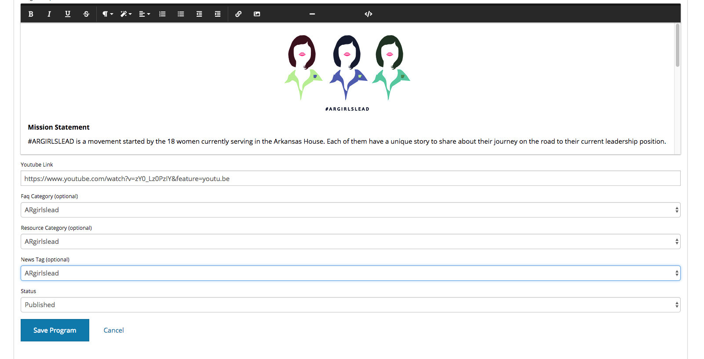

This is the form view that the user will interact with.

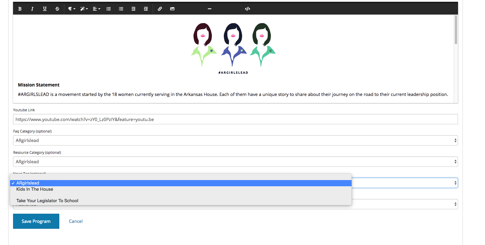

How the select boxes options look. (little bug here with the blank spaces, don't worry about that)

.. raw:: html

    

    

    <h4><code>setAddItemText()</code></h4>
    
The <code>setAddItemText</code> method will allow the user to override the text on the Add button for models. The default text says "Add $dynamo->name" or "Add Faq"
       The reason we created this method is because normally you want to use camelcase(thisIsCamelCase) when naming your Dynamo models and variable names. But you might not want
       the text of the add button to read "Add Faq". You might instead want it to read "Add FAQ". Therefore, the ->setAddItemText function was born.

.. code-block:: trafficscript

    ->setAddItemText('SET ADD TEXT')

Here I call the function ->setAddItemText() to override the default Add Item Text. The next screenshot shows the result.

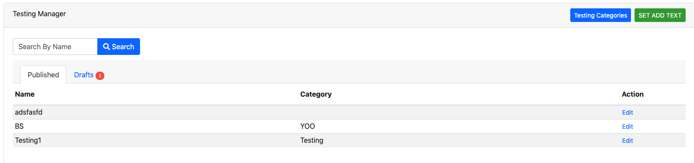

This is the result. Notice in the upper right-hand corner the text of the green "Add" button has changed.

.. raw:: html

    

    

    <h4><code>setFormPanelTitle()</code></h4>
    
The <code>setFormPanelTitle</code> method will allow the user to override the text on the dynamo Form panel.

.. code-block:: trafficscript

    ->setFormPanelTitle("Form boy")

Here I call the function ->setFormPanelTitle() to override the default Form Panel Title Text. The next screenshot shows the result.

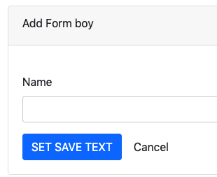

.. raw:: html

    

    

    <h4><code>setIndexPanelTitle()</code></h4>
    
The <code>setIndexPanelTitle</code> method will allow the user to override the text on the dynamo Index panel.

.. code-block:: trafficscript

    ->setIndexPanelTitle("Colton's module manger override text")

Here I call the function ->setIndexPanelTitle() to override the default Index Panel Title Text. The next screenshot shows the result.

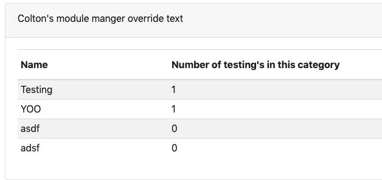

.. raw:: html

    

    

    <h4><code>setSaveItemText()</code></h4>
    
The <code>setSaveItemText</code> method will allow the user to override the text on the blue Save button at the bottom of the dynamo Form.

.. code-block:: trafficscript

    ->setSaveItemText('SET SAVE TEXT')

Here I call the function to override the Save button text on the form.

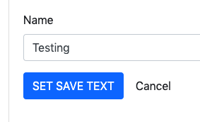

.. raw:: html

    

    

    <h4><code>text()</code></h4>
    
The <code>text</code> method is probably the simplest Dynamo method. It makes a textbox on the form for the given database field. Now, you can of course pass
       in other parameters as you can with all Dynamo methods, such as position (to make the field appear in a different order than default), tooltip(allows you to
       render a ? mark tooltip explaining perhaps the format that is expected in the field), class(where you can assign the input field to have additional class names),
       label(allows you to change the label text of the input field, be default it will be whatever the name of the field is in the database), and you can also do
       closure functions with the "current item" as the argument for the third parameter of the text field. Check out some of the examples below.

.. code-block:: trafficscript

  ->auto()
  ->text('this is a text box, my friend')

The simplest example.

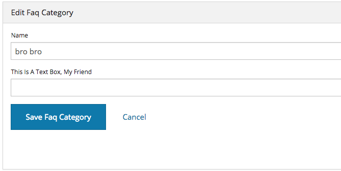

The result on the form. ^

.. code-block:: trafficscript

     ->auto()
     ->text('district', [
         'position' => 0
     ])
     ->singleImage('headshot', [
         'maxWidth' => 400
     ])
     ->singleImage('featured_image', [
         'maxWidth' => 1600
     ])
     ->gallery('gallery')
     ->text('party', [
         'position' => 50
     ])
     ->text('email', [
         'position' => 60
     ])
     ->text('phone', [
         'position' => 60
     ])
     ->text('fax', [
         'position' => 70
     ])
     ->text('address', [
         'position' => 80
     ])
     ->text('city', [
         'position' => 90
     ])
     ->text('zip', [
         'position' => 100
     ])
     ->text('seniority', [
         'position' => 110
     ])
     ->text('religion', [
         'position' => 120
     ])
     ->text('past_service', [
         'position' => 130
     ])

In this example, we pass in an array of options with only one option, that being 'position'. The position option is there so you can manually set the order
of the fields in the form if needed. The auto() function usually handles this, but in some cases you may want to reorder.

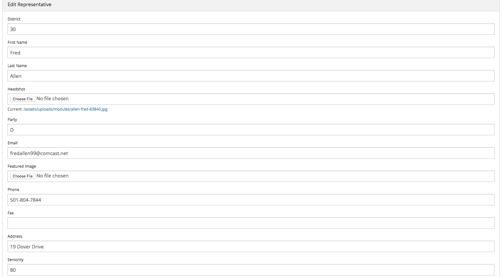

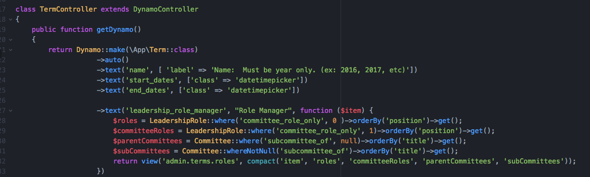

A more complicated example. Here we pass in an option to the top two text fields. This option is 'class' => 'dateTimePicker' which lets a little calendar pop
up to aid the user in selected the dates for the these fields. And I'm not even going to explain what's going on in the third text field. It was a super weird case,
usually things don't look that messy.

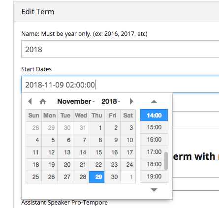

Here we see the dateTimePicker

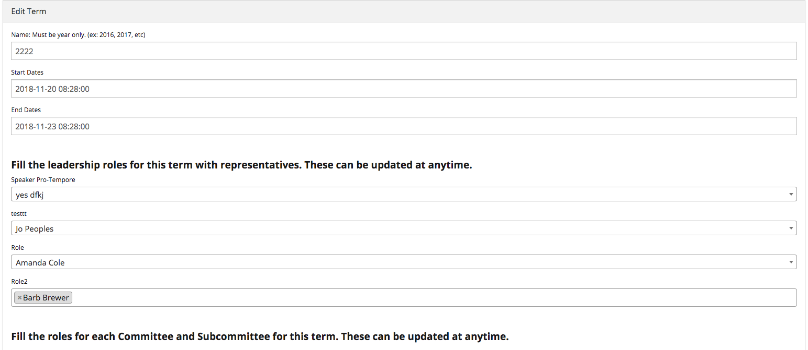

.. raw:: html

    

    

    <h4><code>textarea()</code></h4>
    
The <code>textarea</code> method is just like the text() method, except it's a bigger text box on the form. In many of our websites, we pass in a class
       called "wysiwyg editor" which stands for "What You See Is What You Get". This will only work if you have the Froala text-editor installed in your laravel project.
       There are other text editors like Froala out there you might be able to find as well, and pass a class into the text area function to achieve the same thing.

.. code-block:: trafficscript

    ->textarea('bio', [
      'class' => 'wysiwyg-editor',
    ])

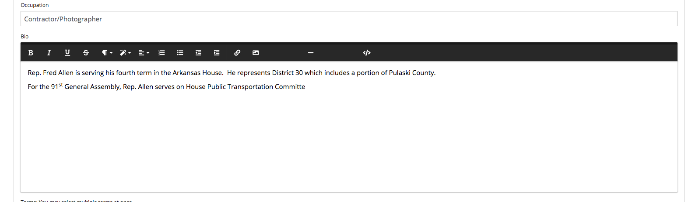

.. raw:: html

    

