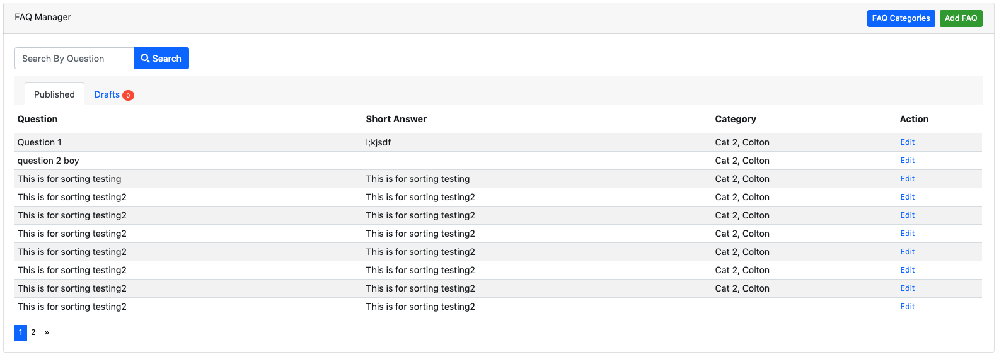
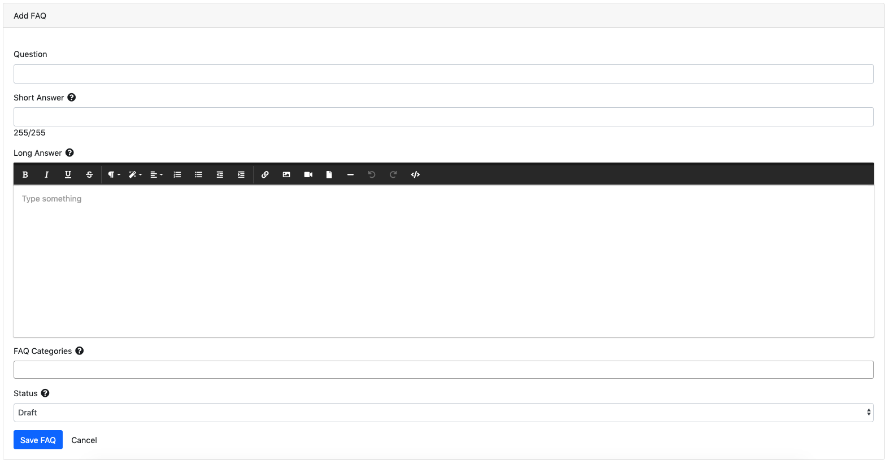

Welcome to Dynamo's documentation!
==================================

.. image:: images/DynamoLogo.jpg
   :align: center
   :width: 500px
   :height: 150px

.. raw:: html

    
When you want to use a package but it doesn't have good documentation...

.. image:: https://media.giphy.com/media/kHU8W94VS329y/giphy.gif
   :align: center

What is Dynamo?
^^^^^^^^^^^^^^^

**Dynamo** is a |package| you can use in your existing |laravel| application to quickly build admins using real database tables. You may be familiar with php artisan
which allows you to create models, views, and controllers, and migration files with some scaffolding.

Dynamo does this, as well as generating the bootstrap index view and forms for creating the models. For an example,
see the screenshots below showing a form on the backend of the website for the administrator to use to create Faqs.

This ^ is the *index* view of a module that shows a table of all the FAQs in the database.

This ^ is the *form* view of a module that shows the form that the website administrator uses to create a new FAQ or update an existing FAQ.

.. |package| raw:: html

  <a href="https://packagist.org/packages/jzpeepz/dynamo" target="_blank">package</a>

.. |laravel| raw:: html

   <a href="https://laravel.com/docs/5.7" target="_blank">Laravel</a>

.. raw:: html

   

The Dynamo Artisan Command
^^^^^^^^^^^^^^^^^^^^^^^^^^

Dynamo allows you to create a complete controller, model, migration, and route for your backend admin module with one command:

.. code-block:: trafficscript

   php artisan make:dynamo Employee

After running this you will notice an autogenerated route in your routes->web.php file. You will notice a new database migration
has been created in your database->migrations directory. You will notice a new model made in your app directory.
You will notice a new Dynamo Controller in your controller directory. By default the controller directory is set in your dynamo config file in config->dynamo.php::

   'controller_namespace' => 'App\Http\Controllers',

   'controller_path' => app_path('/Http/Controllers'),

Need to opt out of some of the Dynamo magic?

.. code-block:: trafficscript

   php artisan make:dynamo Employee --migration=no --model=no --controller=no --route=no

I recommend starting out with the quick-start video below to see what Dynamo is capable of doing and seeing if it is right for you.
If you see that it is right for you, you can install Dynamo by running:

.. code-block:: trafficscript

    composer require jzpeepz/dynamo

Quick-Start Video
^^^^^^^^^^^^^^^^^

.. raw:: html

    
<iframe width="560" height="315" src="https://www.youtube.com/embed/Hf6J2hTrWa0" frameborder="0"
    allow="accelerometer; autoplay; encrypted-media; gyroscope; picture-in-picture" allowfullscreen></iframe>

    

.. toctree::
   :caption: Dynamo Documentation
   :maxdepth: 2

   theDynamoControllerBackEnd
   theDynamoControllerFrontEnd
   installation
   many-to-many
   dynamoMethods
   relationshipDeleteModal
   relatingModelsToThemselves

.. toctree::
   :caption: License
   :maxdepth: 2

   license
