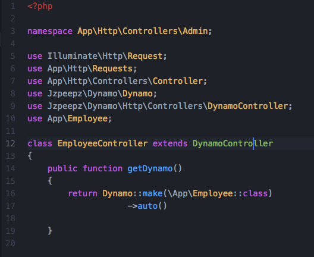
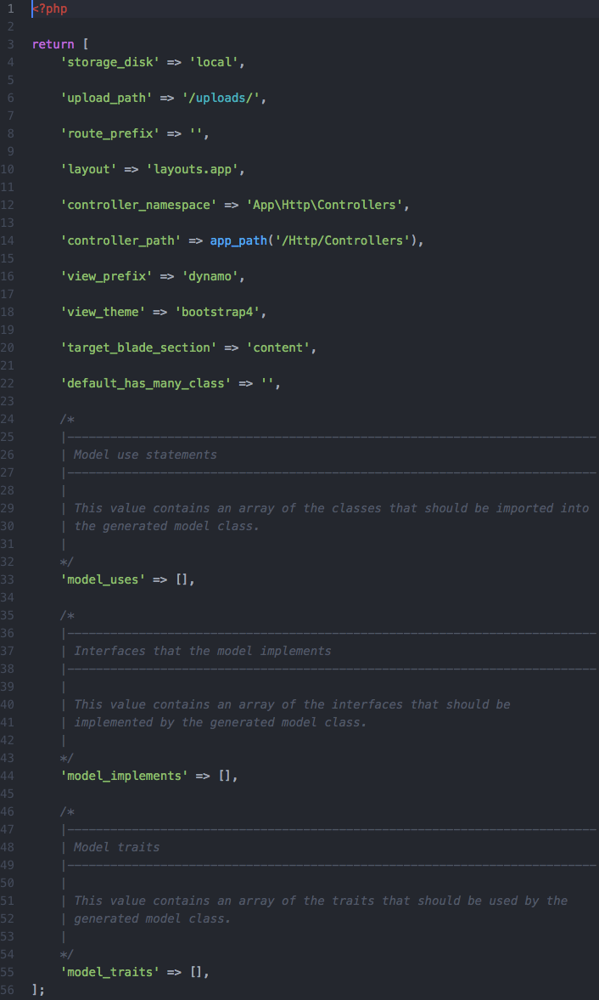

Welcome to Dynamo's documentation!
==================================

.. contents::
   :depth: 2

.. .. toctree::
..    :maxdepth: 2
..
..    license

When you want to use a package but it doesn't have good documentation...

.. image:: https://media.giphy.com/media/kHU8W94VS329y/giphy.gif
    :align: center

What is Dynamo?
^^^^^^^^^^^^^^^

**Dynamo** is a |package| you can use in your existing PHP |laravel| framework application to build admins. Dynamo is especially useful if
you want to create your own custom CMS (content management system).

.. |package| raw:: html

   <a href="https://packagist.org/packages/jzpeepz/dynamo" target="_blank">package</a>

.. |laravel| raw:: html

    <a href="https://laravel.com/docs/5.7" target="_blank">Laravel</a>

It allows you to create a controller, model, migration, and route for your admin with one command:

.. code-block:: php

    php artisan make:dynamo Employee

After running this you will notice an autogenerated route in your routes->web.php file. You will notice a new database migration
has been created in your database->migrations directory. You will notice a new model made in your app directory.
You will notice a new Dynamo Controller in your controller directory. By default the controller directory is set in your config file::

    'controller_namespace' => 'App\Http\Controllers',

    'controller_path' => app_path('/Http/Controllers'),

Need to opt out of some of the Dynamo magic?

.. code-block:: PHP

    php artisan make:dynamo Employee --migration=no --model=no --controller=no --route=no

Customizing the admin
^^^^^^^^^^^^^^^^^^^^^

The most helpful part about Dynamo is the Dynamo Controller.

Admin customization happens in your controller inside the getDynamo() function.
This function returns a Dynamo instance which has lots of chainable methods that customize your Dynamo admin. Lets stick with our Employee example:

This what your DynamoController will look like by default. It has one function called getDynamo() that returns a Dynamo object. By default the auto() function
is called which will take all the things your're employee object consist of (that you defined in your database migration) and create fields in the form for them.
You can chain on methods to this auto function if you need to do more specific things. It's super easy! Check it out...

.. image:: images/ControllerExample.gif
    :align: center

.. image:: images/EmployeeController2.png
    :align: center

Everything you see before the comment "//ClearIndexes" will appear in the form view when someone is creating an Employee object in the database.
Everything you see after the comment "//ClearIndexes" will appear in the index view when someone is viewing all the Employees in the database.
Now, keep in mind, all the function calls you see above happened automatically with the auto() function.
The only thing the auto function can't do is stuff like renaming a field like you see happen at "->file("photo", "Headshot")" where
you might want it to say Headshot rather than photo. This is the basics of Dynamo.

Installation
============

Install via Composer::

    composer require jzpeepz/dynamo

Include the service provider in your config/app.php::

    Jzpeepz\Dynamo\DynamoServiceProvider::class

Publish the Dynamo config file::

    php artisan vendor:publish --tag=dynamo

.. note:: NOTE: If using a local disk for uploading, be sure to symlink it to your public directory and provide the proper path in the config file.

If you'd like, the Github repo for Dynamo is |github|.

.. |github| raw:: html

   <a href="https://github.com/jzpeepz/dynamo" target="_blank">here</a>

Configuration
=============

You can edit the configuration of Dynamo at:

vendor->jzpeepz->dynamo->src->config->dynamo.php.

Storage disk to use to store uploaded files.

Path within the storage disk to store the uploaded files. This is also the directory within the public directory to which the storage directory is linked.

Prefix to add to all Dynamo routes.

Layout to use with Dynamo views.

Controller Namespace and path tells Dynamo where you want you're controllers to be auto-generated. TODO

Creating Form Groups
====================

.. code-block:: PHP

    return Dynamo::make(\App\Employee::class)
		->group('groupName', function($dynamo) {
			$dynamo->text('fieldName')
		   		   ->text('fieldName');
		});

Creating Many-to-Many Relationships Between Dynamo Models
=========================================================

Step 1: Generate the two models you will be using.
^^^^^^^^^^^^^^^^^^^^^^^^^^^^^^^^^^^^^^^^^^^^^^^^^^

.. code-block:: PHP

    php artisan make:dynamo Faq
    php artisan make:dynamo Category

Step 2: Complete the needed migrations.
^^^^^^^^^^^^^^^^^^^^^^^^^^^^^^^^^^^^^^^

Example Faq migration::

    Schema::create('faqs', function (Blueprint $table) {
    	$table->increments('id');
    	$table->string('question', 255);
    	$table->mediumText('answer');
    	$table->timestamps();
    });

Example Category migration::

    Schema::create('categories', function (Blueprint $table) {
    	$table->increments('id');
    	$table->string('name');
    	$table->timestamps();
    });

Example pivot table migration::

    Schema::create('category_faq', function(Blueprint $table) {
    	$table->integer('faq_id')->unsigned()->nullable();
    	$table->foreign('faq_id')->references('id')->on('faqs');

    	$table->integer('category_id')->unsigned()->nullable();
    	$table->foreign('category_id')->references('id')->on('categories');
    });

Run::

    php artisan migrate

Step 3: Add the proper belongsToMany Eloquent function to each model.
^^^^^^^^^^^^^^^^^^^^^^^^^^^^^^^^^^^^^^^^^^^^^^^^^^^^^^^^^^^^^^^^^^^^^

For the Category model::

    public function faqs()
    {
	   return $this->belongsToMany('App\Faq');
    }

For the Faq Model::

    public function categories()
    {
	return $this->belongsToMany('App\Category');
    }

Step 4: Chain the hasMany() method onto your Dynamo instance in both controllers. Make sure your key is the name of the Eloquent function from you model.
^^^^^^^^^^^^^^^^^^^^^^^^^^^^^^^^^^^^^^^^^^^^^^^^^^^^^^^^^^^^^^^^^^^^^^^^^^^^^^^^^^^^^^^^^^^^^^^^^^^^^^^^^^^^^^^^^^^^^^^^^^^^^^^^^^^^^^^^^^^^^^^^^^^^^^^^^
.. code-block:: PHP

    return Dynamo::make(\App\Employee::class)
			->hasMany('categories', ['options' => [$categories]]);
