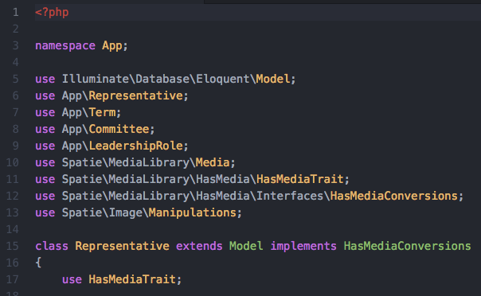

Installation
============

Install via Composer::

    composer require jzpeepz/dynamo

Include the service provider in your config/app.php::

    Jzpeepz\Dynamo\DynamoServiceProvider::class

Publish the Dynamo config file::

    php artisan vendor:publish --tag=dynamo

.. note:: NOTE: If using a local disk for uploading, be sure to symlink it to your public directory and provide the proper path in the config file.

If you'd like, the Github repo for Dynamo is |github|.

.. |github| raw:: html

   <a href="https://github.com/jzpeepz/dynamo" target="_blank">here</a>

.. raw:: html

   <strong style="font-size: 20px;">Configuration</strong>  

You can edit the configuration of Dynamo at:

vendor->jzpeepz->dynamo->src->config->dynamo.php.

The vendor folder is a hidden folder, so much sure your text editor is letting you see it. jzpeeps is the root folder for the Dynamo package.

.. image:: images/config.png
    :align: center

Storage disk to use to store uploaded files.

Upload_path is the path within the storage disk to store the uploaded files. This is also the directory within the public directory to which the storage directory is linked.

route_prefix is a prefix to add to all Dynamo routes.

layout is the layout to use with Dynamo views.

controller_namespace and controller_path is the path that tells Dynamo where you want you're controllers to be auto-generated.

view_prefix does this... TODO

view_theme is the HTML / CSS framework you are using. Dynamo is build to run on either 'bootstrap3' or 'bootstrap4'.

target_blade_section does this... TODO

default_has_many_class does this ... TODO

.. raw:: html

    

model_uses, just like the comment says, is used to generate use statements automatically into the Model class that is generated when you make a Dynamo object.

model_implements, similar to model_uses, tells Dynamo what interfaces you want your Dynamo objects to implement.

Finally, model_traits tells Dynamo what traits the object should use.

See an example of a auto generated Dynamo object below that uses these last three configurations to generate models that use a Media Manager package from Spatie.

